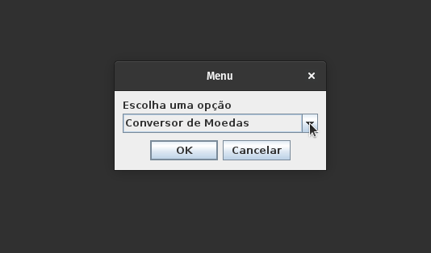

# 💱️ Conversores 💱️

 

## 📑️ Índice
* [Descrição do projeto](#descrição-do-projeto)
* [Funcionalidades e Demonstração da Aplicação](#funcionalidades-e-demonstração-da-aplicação)
* [Como Baixar o Projeto](#como-baixar-o-projeto)
* [Como Executar o Projeto](#como-executar-o-projeto)

## 📝️ Descrição do projeto
Aplicação conversora de moedas e temperatura, desenvolvida para o desafio de desenvolver um conversor com a linguagem de programação Java. O desafio faz parte do programa Oracle Next Education.

## 💻️ Funcionalidades e Demonstração da Aplicação

 
 
Conversão das seguintes moedas:  
- Reais para Dólares americanos, Reais para Euros, Reais para Ienes, Reais para Libras Esterlinas, Reais para Peso Argentino, Reais para Peso Chileno, Dólares americanos para Reais, Euros para Reais, Ienes para Reais, Libras Esterlinas para Reais, Peso Argentino para Reais e Peso Chileno para Reais.  

> ⚠️ As taxas de conversão estão com valores fixos, ou seja, não estão atualizadas!

Conversão das escalas termométricas:   
- Célsius para Kelvin, Célsius para Fahrenheit, Kelvin para Célsius, Kelvin para Fahrenheit, Fahrenheit para Célsius e Fahrenheit para Kelvin.

## 📂️ Como Baixar o Projeto
1. Você pode baixar o projeto clicando no botão `Code` que se encontra mais acima nessa página, e após isso clique em `Download ZIP`;
2. Após baixar o projeto para o seu computador, extraia o arquivo ZIP;
3. Para executar a aplicação, somente será necessário o arquivo `Conversor.jar`.

## ⚙️ Como Executar o Projeto
1. Para isso você deve ter instalado no seu computador o Java Runtime Environment (JRE) ou Java Development Kit (JDK);
2. Com o JRE ou JDK instalado e o projeto baixado em seu computador. Abra o arquivo `Conversor.jar` com dois cliques;
3. Se por acaso a aplicação não iniciar, abra o terminal de seu computador e estando no caminho onde o projeto se encontra no computador, digite `java -jar Conversor.java` e aperte `Enter`.
